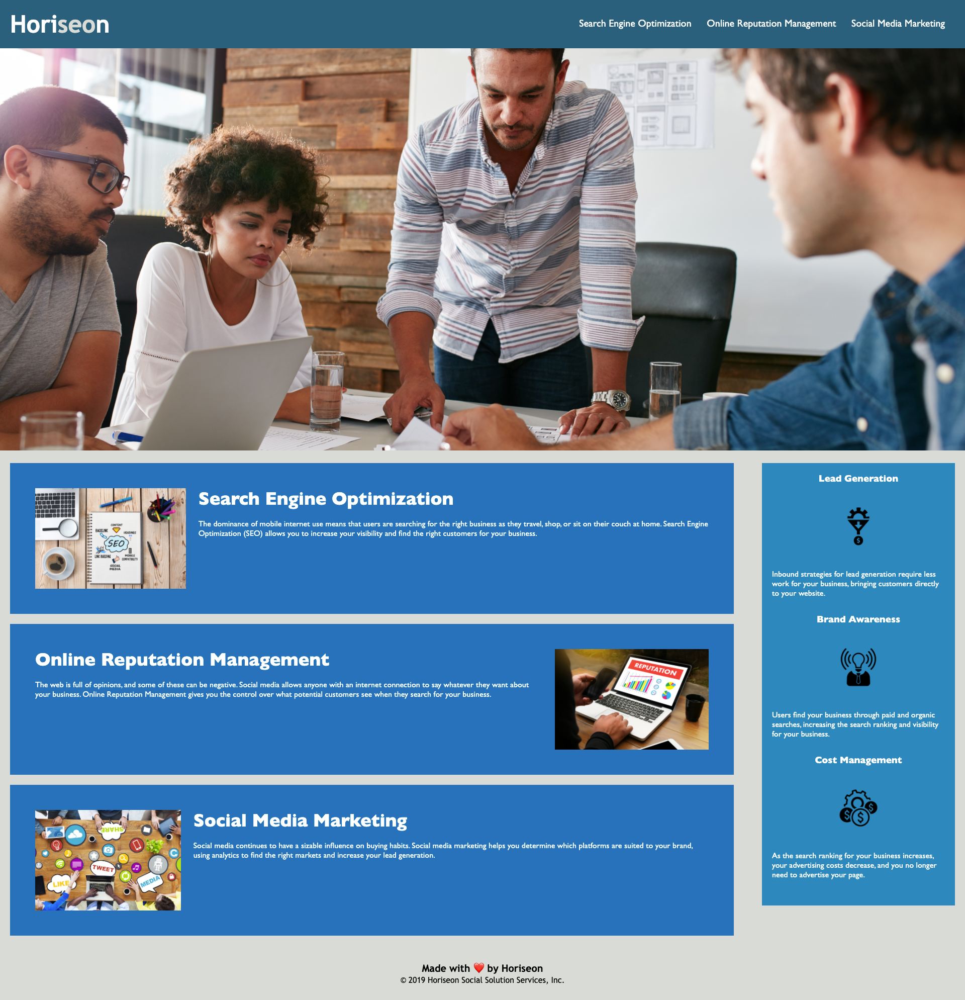

# Horiseon Project

## Project Link

Click [here](https://surajverma2587.github.io/homework-week-1/) to view project on GitHub pages.
## Description

As a marketing agency we were tasked to refactor the webpage by Horiseon by adding Semantic HTML and making the website more accessible

## What did we do?

- Replace HTML element with semantic HTML elements
- Fixed nav link bug
- Updated title of webpage for SEO
- Made images more accessible by adding alt attributes
- Formatted code using lint (prettier)

## Getting Started

- Clone the GitHub project on to your local machine
- Navigate in to the project
- Open the project in VSCode
- Open the `index.html` file in your default browser

```
git clone git@github.com:surajverma2587/homework-week-1.git
cd homework-week-1
code .
```

## Screenshots

### Before Refactor



### After Refactor

